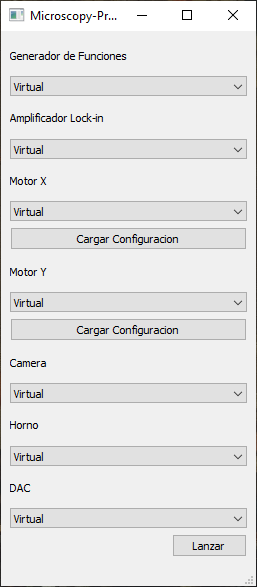
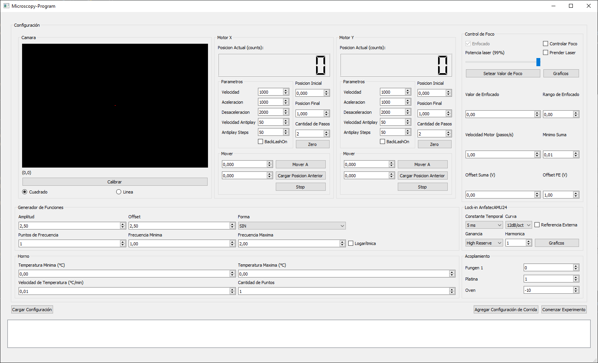
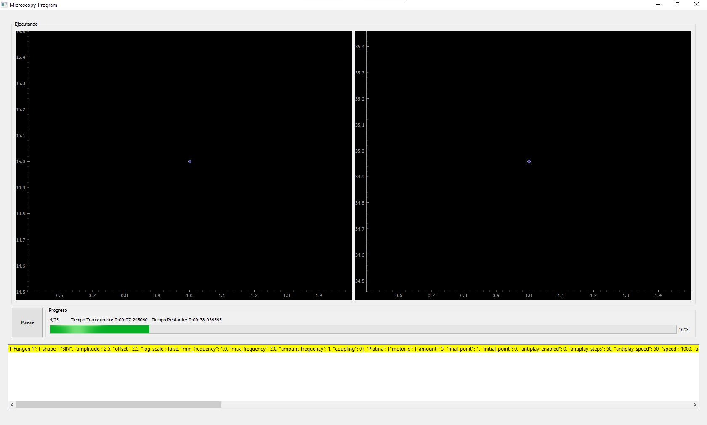
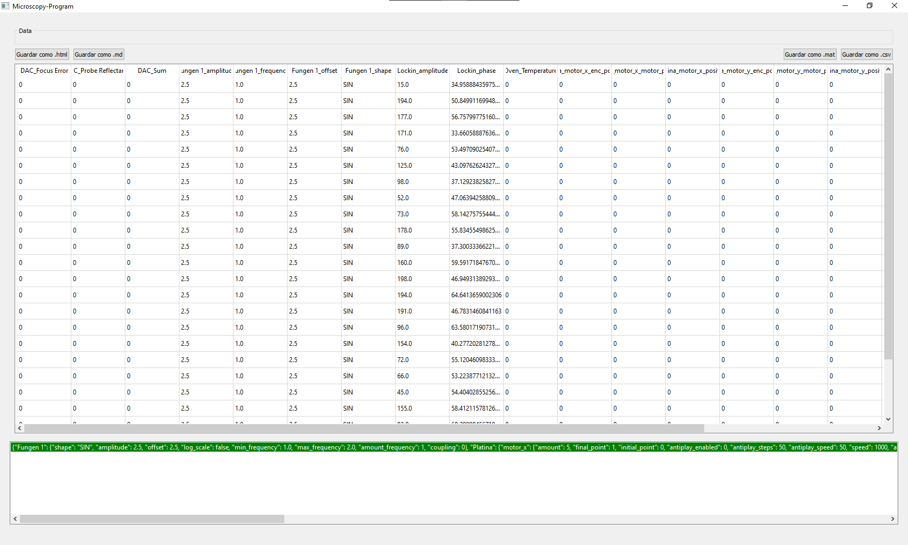

# Microscopy-Program User Manual

## Table of Contents

1. [Introduction](#introduction)
2. [System Requirements](#system-requirements)
3. [Installation](#installation)
4. [Quick Start Guide](#quick-start-guide)
5. [Device Selection](#device-selection)
6. [Experiment Configuration](#experiment-configuration)
7. [Running an Experiment](#running-an-experiment)
8. [Data Export](#data-export)
9. [Configuration Reference](#configuration-reference)
10. [Troubleshooting](#troubleshooting)
11. [Appendix](#appendix)

---

## Introduction

The Microscopy-Program is control software for a photothermal microscope developed at the Laboratorio de Haces Dirigidos, Facultad de Ingenieria, Universidad de Buenos Aires.

### What This Software Does

This software automates and coordinates multiple laboratory instruments to perform photothermal microscopy experiments:

- **Sample Scanning**: Control motorized translation stages (X, Y, Z axes) to scan samples
- **Signal Generation**: Control function generators for frequency sweeps
- **Signal Measurement**: Read lock-in amplifier data for precision measurements
- **Image Capture**: Capture and display camera images for sample positioning
- **Temperature Control**: Manage heating with temperature-controlled ovens
- **Focus Control**: Monitor and adjust focus using laser feedback

### Workflow Overview

```
┌─────────────────────┐
│  1. Device Selection │  Select which instruments to use
└──────────┬──────────┘
           ▼
┌─────────────────────┐
│  2. Configuration    │  Set parameters for each device
└──────────┬──────────┘
           ▼
┌─────────────────────┐
│  3. Run Experiment   │  Execute with real-time monitoring
└──────────┬──────────┘
           ▼
┌─────────────────────┐
│  4. Export Data      │  Save results in CSV or MATLAB format
└─────────────────────┘
```

---

## System Requirements

### Operating System

- **Windows 10/11** (required for hardware drivers)

### Software Requirements

| Component | Minimum Version | Notes |
|-----------|-----------------|-------|
| Python | 3.11.4 | Anaconda distribution recommended |
| PyQt5 | 5.15+ | GUI framework |

### Hardware Drivers

The following external drivers must be installed based on your equipment:

| Device | Driver | Download Link |
|--------|--------|---------------|
| Lock-in AMU 2.4 | `AMU 2.4 Lockin.dll` | [Anfatec](https://www.anfatec.de/products/3_lockin/amu/24/pci-bus_lockin_amplifier_amu24.html) |
| Translation Stage | XIMC Software Package | [Standa](https://files.xisupport.com/Software.en.html) |
| Lumenera Camera | LgCam Software | [Lumenera](https://www.lumenera.com/support/industrial-usb-ethernet/drivers-downloads.html) |
| MCC DAQ | MCCDAQ UL for Windows | [Digilent](https://cloud.digilent.com/myproducts/ULxforWindows) |

---

## Installation

### Step 1: Install Python

1. Download Anaconda from https://www.anaconda.com/download
2. Run the installer and follow the prompts
3. Verify installation by opening Anaconda Prompt and typing:
   ```
   python --version
   ```

### Step 2: Create Virtual Environment (Recommended)

```bash
conda create -n microscopy python=3.11
conda activate microscopy
```

### Step 3: Install Python Dependencies

Navigate to the Microscopy-Program directory and run:

```bash
pip install -r requirements.txt
```

For exact tested versions, use:

```bash
pip install -r frozenreqs.txt
```

### Step 4: Install Hardware Drivers

Install the appropriate drivers for your equipment (see System Requirements table above).

### Step 5: Verify Installation

Run the program to verify everything is installed correctly:

```bash
python main.py
```

The device selection window should appear.

---

## Quick Start Guide

### Running Your First Experiment (Virtual Mode)

This guide walks you through a test run using virtual (simulated) devices.

1. **Launch the Program**
   ```bash
   python main.py
   ```

2. **Select Virtual Devices**
   - Set all device dropdowns to "Virtual" options
   - Click **Launch**

3. **Configure a Simple Scan**
   - In the Motor X section, set:
     - Initial: 0
     - Final: 10
     - Steps: 5
   - In the Function Generator section, set:
     - Initial Frequency: 100
     - Final Frequency: 1000
     - Steps: 10
     - Scale: Logarithmic

4. **Run the Experiment**
   - Click the **Run** button
   - Watch the real-time graphs update

5. **Export Data**
   - After completion, go to the Data tab
   - Click **Save CSV** to export your results

---

## Device Selection

When you launch the program, you'll see the device selection screen:



### Available Devices

#### Function Generator
| Option | Description |
|--------|-------------|
| Virtual | Simulated generator for testing |
| HP 33120A | HP function generator via GPIB/Prologix adapter |
| Rigol DG1022 | Rigol generator via USB |

#### Lock-in Amplifier
| Option | Description |
|--------|-------------|
| Virtual | Simulated lock-in with demo data |
| Anfatec AMU 2.4 | Via DLL interface |
| NF LI5655/LI5660 | Via VISA/USB |

#### Translation Stage (Motors)
| Option | Description |
|--------|-------------|
| Virtual | Simulated motor for testing |
| 8MT173-10 | Standa 8MT173-10 motor with config file |
| 8MTF-75LS05 | Standa 8MTF-75LS05 motor with encoder |
| Flash Stage | Fast positioning stage |
| Other XIMC motors | Any XIMC-compatible motor |

#### Camera
| Option | Description |
|--------|-------------|
| Virtual | Simulated camera for testing |
| Lumenera Infinity 1 | Professional microscopy camera |
| Web Cam | Any OpenCV-compatible webcam |

#### Oven
| Option | Description |
|--------|-------------|
| Virtual | Simulated oven for testing |
| Linkam TMS 94 | Temperature-controlled stage |

#### DAC (Digital-to-Analog Converter)
| Option | Description |
|--------|-------------|
| Virtual | Simulated DAC for testing |
| MCC USB-2527 | Measurement Computing USB DAQ |

### Motor Configuration Files

Motor configuration files (`.cfg`) define motor-specific parameters:
- Feedback type and direction
- Counts-to-distance conversion factor
- Speed and acceleration limits

These files are located in `components/Platina/` and follow the XIMC format.

---

## Experiment Configuration

After selecting devices and clicking **Launch**, you'll see the configuration screen:



### Camera Section

The camera section shows a live video feed and allows you to define scan paths.

**Features:**
- **Live Preview**: Real-time camera image
- **Click-to-Scan**: Click on the image to define motor positions
- **Scan Mode**: Choose between Square (grid) or Line scanning

**Calibration:**

To calibrate pixel-to-distance conversion:

1. Click the **Calibrate** button
2. Follow the on-screen instructions
3. Click two points of known distance apart
4. Enter the actual distance


### Motor Section

Each motor (X, Y, Z) has its own configuration panel.

| Parameter | Description |
|-----------|-------------|
| Current Position | Displays the motor's current location |
| Initial | Starting position for the scan |
| Final | Ending position for the scan |
| Steps | Number of measurement points |
| Speed | Motor movement speed |
| Acceleration | Motor acceleration rate |
| Backlash | Anti-backlash compensation |

**Moving the Motor Manually:**
1. Enter a target position in the "Move to" field
2. Click the move button
3. Use **Stop** in case of emergency

**Setting Zero:**
- Click the "Set Zero" button to define the current position as the origin

**Scan Path Examples:**

For Square mode with Motor X (0→2, 3 steps) and Motor Y (0→2, 3 steps):
```
(0,0) → (1,0) → (2,0)
(0,1) → (1,1) → (2,1)
(0,2) → (1,2) → (2,2)
```

For Line mode with the same parameters:
```
(0,0) → (1,1) → (2,2)
```

### Function Generator Section

| Parameter | Description |
|-----------|-------------|
| Initial Frequency | Starting frequency in Hz |
| Final Frequency | Ending frequency in Hz |
| Steps | Number of frequency points |
| Scale | Linear or Logarithmic spacing |
| Amplitude | Signal amplitude in Volts |
| Offset | DC offset in Volts |
| Waveform | Signal shape (Sine, Square, Triangle, etc.) |

**Example - Logarithmic Sweep:**
- Initial: 10 Hz
- Final: 1000 Hz
- Steps: 3
- Scale: Logarithmic
- Result: 10 Hz → 100 Hz → 1000 Hz

### Lock-in Amplifier Section

| Parameter | Description |
|-----------|-------------|
| Time Constant | Integration time (affects noise vs. speed) |
| Sensitivity | Input gain setting |
| Slope | Filter roll-off (6, 12, 18, or 24 dB/oct) |
| Harmonic | Which harmonic to measure (1 = fundamental) |
| External Reference | **Must be ON for experiments** |

**Real-time Graphs:**

The lock-in section displays live graphs showing:
- Reflectance signal
- Error signal


### Oven Section

| Parameter | Description |
|-----------|-------------|
| Initial Temperature | Starting temperature in °C |
| Final Temperature | Ending temperature in °C |
| Steps | Number of temperature points |
| Rate | Heating/cooling rate in °C/min |

### DAC/Focus Control Section

| Parameter | Description |
|-----------|-------------|
| Laser On/Off | Toggle probe laser |
| Laser Power | Adjust laser intensity |
| Focus Control | Enable/disable autofocus (experimental) |

**Real-time Graphs:**


- **Reflectance**: Sample reflectivity signal
- **ABCD Sum**: Photodiode sum for alignment
- **Focus Error**: Error signal for autofocus

### Device Coupling

Coupling determines the order in which device parameters vary during the experiment.

**Rule:** Higher coupling number = faster cycling

**Example:**
- Oven coupling = 1, values: 40°C, 50°C
- Function Generator coupling = 2, values: 100 Hz, 1000 Hz

Resulting measurement sequence:
```
(40°C, 100 Hz) → (40°C, 1000 Hz) → (50°C, 100 Hz) → (50°C, 1000 Hz)
```

---

## Running an Experiment

After configuring all parameters, click **Run** to start the experiment.



### Real-time Monitoring

During execution, you'll see:
- **Phase Graph**: Phase vs. log(frequency) in degrees
- **Amplitude Graph**: log(amplitude) vs. log(frequency) in Volts
- **Progress Indicator**: Current point / total points

### Stopping an Experiment

Click the **Stop** button to abort the experiment at any time. Data collected up to that point will be preserved.

---

## Data Export

After the experiment completes (or is stopped), navigate to the Data tab.



### Viewing Data

The data table displays all collected measurements with columns for:
- Motor positions
- Frequency values
- Lock-in amplitude and phase
- Temperature readings
- Timestamps

### Saving Variable Documentation

1. Click **Save Variables** (upper left)
2. Enter descriptions and units for each variable
3. This metadata is saved alongside your data

### Exporting Data

| Format | Button | Description |
|--------|--------|-------------|
| CSV | Save CSV | Comma-separated values, opens in Excel |
| MATLAB | Save MATLAB | .mat file for MATLAB analysis |

---

## Configuration Reference

### devices.ini

This file configures connection parameters for hardware devices. It is auto-generated on first run.

```ini
[HP33120AFungen]
PROLOGIX ADDR = 10      ; GPIB address for HP function generator

[Web Cam]
Index = 0               ; OpenCV camera index

[Linkam TMS 94]
Port = 15               ; COM port number (15 = COM15)

[USB2527DAC]
Board Num = 0           ; MCC board number
```

**Location:** Same directory as `main.py`

### Motor Configuration Files

Located in `components/Platina/`, these `.cfg` files define motor parameters:

| File | Motor Model |
|------|-------------|
| `8MT173-10.cfg` | Standa 8MT173-10 |
| `8MTF-75LS05-Encoder-X.cfg` | 8MTF-75LS05 X-axis with encoder |
| `8MTF-75LS05-Encoder-Y.cfg` | 8MTF-75LS05 Y-axis with encoder |
| `flash_eje_x.cfg` | Flash stage X-axis |
| `flash_eje_y.cfg` | Flash stage Y-axis |

---

## Troubleshooting

### Device Connection Issues

**Problem:** Device not found

**Solutions:**
1. Verify the device is powered on and connected
2. Check USB/serial cable connections
3. Verify driver installation
4. Check `devices.ini` for correct port/address settings
5. Try unplugging and reconnecting the device

**Problem:** "Permission denied" errors

**Solutions:**
1. Run the program as Administrator
2. Close other programs that might be using the device
3. Check that no other instance of Microscopy-Program is running

### Motor Issues

**Problem:** Motor not moving

**Solutions:**
1. Check that the motor controller is powered on
2. Verify the correct motor configuration file is selected
3. Check XIMC software installation
4. Try the "Home" button to initialize the motor

**Problem:** Motor position is incorrect

**Solutions:**
1. Re-zero the motor at a known position
2. Check the counts-to-distance conversion in the .cfg file
3. Verify backlash compensation settings

### Camera Issues

**Problem:** No camera image

**Solutions:**
1. Check camera connection and power
2. Verify correct camera driver is installed
3. For webcam: try different index values in `devices.ini`
4. Check that no other application is using the camera

**Problem:** Image is dark or overexposed

**Solutions:**
1. Adjust camera exposure settings (if available)
2. Check illumination
3. Try a different camera option

### Lock-in Amplifier Issues

**Problem:** No signal / zero readings

**Solutions:**
1. Verify external reference is enabled
2. Check that the function generator is outputting a signal
3. Verify correct sensitivity and time constant settings
4. Check cable connections

**Problem:** Noisy signal

**Solutions:**
1. Increase time constant (slower but less noisy)
2. Check for ground loops
3. Verify shield connections on cables
4. Reduce nearby electronic interference

### Data Export Issues

**Problem:** Cannot save data

**Solutions:**
1. Check that you have write permissions to the destination folder
2. Close any programs that might have the file open
3. Try saving to a different location

### General Issues

**Problem:** Program crashes on startup

**Solutions:**
1. Verify all dependencies are installed: `pip install -r requirements.txt`
2. Check Python version: `python --version` (should be 3.11+)
3. Try running in virtual mode (all devices set to Virtual)
4. Check the console for error messages

**Problem:** Program is slow or unresponsive

**Solutions:**
1. Close unnecessary background applications
2. Reduce the number of measurement points
3. Check for sufficient disk space
4. Restart the program

---

## Appendix

### A. Supported Waveforms

| Waveform | Description |
|----------|-------------|
| Sine | Sinusoidal wave |
| Square | Square wave |
| Triangle | Triangular wave |
| Ramp | Sawtooth wave |
| Noise | Random noise |
| DC | Constant voltage |

### B. Lock-in Time Constants

| Setting | Response Time | Use Case |
|---------|---------------|----------|
| 1 ms | Very fast | High-frequency measurements |
| 10 ms | Fast | Quick scans |
| 100 ms | Medium | General use |
| 1 s | Slow | Low-noise measurements |
| 10 s | Very slow | Precision measurements |

### C. File Formats

**CSV Format:**
```
time,motor_x,motor_y,frequency,amplitude,phase
0.0,0.0,0.0,100.0,0.00123,45.2
0.5,0.0,0.0,200.0,0.00098,42.1
...
```

**MATLAB Format:**
- Standard .mat file
- Variables are stored as arrays
- Variable names match column headers

### D. Keyboard Shortcuts

| Key | Action |
|-----|--------|
| Arrow Keys | Manual motor control (when enabled) |
| Escape | Stop current operation |
| Ctrl+S | Save data |

### E. Related Documentation

- [SER Framework Documentation](https://github.com/FranciscoGauna/SER) - Experiment sequencing framework
- [XIMC Documentation](https://files.xisupport.com/Software.en.html) - Motor controller documentation
- [Lantz Drivers](https://github.com/lantzproject/lantz-drivers) - Hardware driver framework

### F. Contact and Support

For issues and feature requests, please refer to the original development team at the Laboratorio de Haces Dirigidos, Facultad de Ingenieria, Universidad de Buenos Aires.

---

*This manual was written for Microscopy-Program developed by Facundo Zaldivar Escola.*
