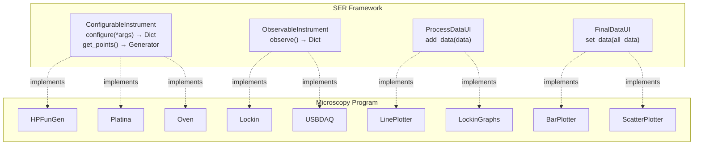
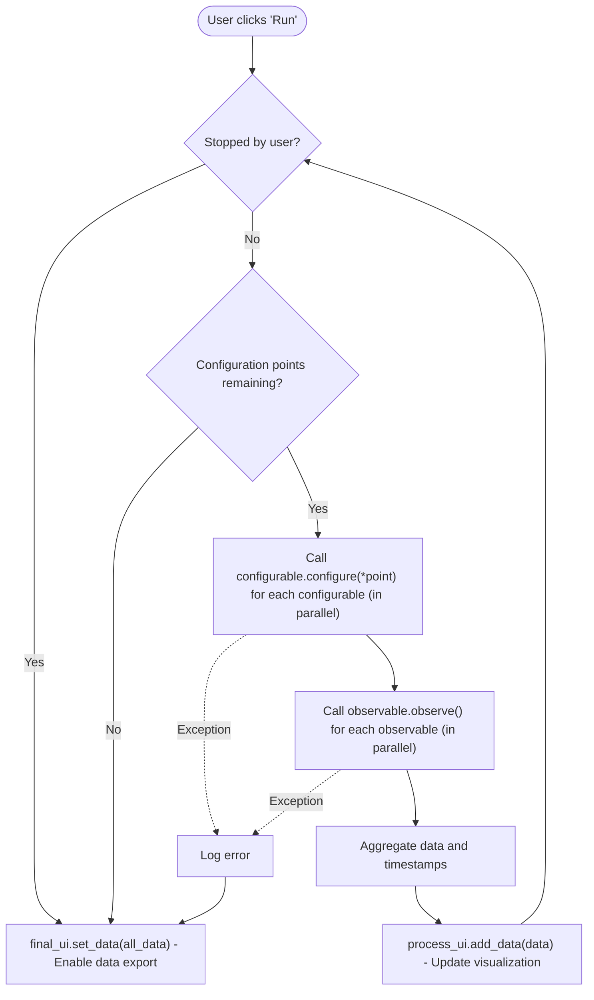

# Microscopy-Program Developer Manual

## Table of Contents

1. [Introduction](#1-introduction)
2. [Architecture Overview](#2-architecture-overview)
3. [Project Structure](#3-project-structure)
4. [Technology Stack](#4-technology-stack)
5. [Core Frameworks](#5-core-frameworks)
6. [Component System](#6-component-system)
7. [Hardware Components Reference](#7-hardware-components-reference)
8. [Threading Model](#8-threading-model)
9. [Adding New Components](#9-adding-new-components)
10. [Configuration System](#10-configuration-system)
11. [Testing and Development](#11-testing-and-development)
12. [External Resources](#12-external-resources)

---

## 1. Introduction

### Purpose

The **Microscopy-Program** is Python-based laboratory instrument control software designed for operating a photothermal microscope. It was developed at the *Laboratorio de Haces Dirigidos*, Facultad de Ingenieria, Universidad de Buenos Aires by Facundo Zaldivar Escola.

### What the Software Does

The application coordinates multiple laboratory instruments to perform automated photothermal microscopy experiments:

- **Sample Scanning**: Controls motorized translation stages (X, Y, Z axes)
- **Signal Generation**: Controls function generators for frequency sweeps
- **Signal Measurement**: Reads lock-in amplifier data for precision measurements
- **Image Capture**: Captures and displays camera images for sample positioning
- **Temperature Control**: Manages heating experiments with temperature-controlled ovens
- **Focus Control**: Monitors and adjusts focus using laser feedback and DAQ board

### High-Level Workflow

```
1. Device Selection     -> Select which instruments to use (real or virtual)
2. Configuration        -> Set parameters for each device
3. Run Experiment       -> Execute with real-time monitoring
4. Export Data          -> Save results in CSV or MATLAB format
```

---

## 2. Architecture Overview

### Design Philosophy

The codebase follows a **Component-Based Architecture** using the SER (Scientific Experiment Runner) framework. Each hardware device is encapsulated in a `Component` class that integrates with the framework for experiment sequencing. For details on the SER framework and its interfaces, see [Section 5](#5-core-frameworks).

### Component Architecture Diagram



> [Edit diagram on mermaid.live](https://mermaid.live/edit#pako:eNptUtFKw0AQ_JXlnhQsYtUXkYKmrQoWii0oJFI2l216trktdxf70PbfvWskibb7tDPDLbNzuxWSMxJ3IHKD6wVM-4kGX7ZMK2KESr8rnfGmEkI9xIkYY640QkYwoRVJqVgH0Fd2zVY59c32PjWXvWGpn0hDUnZvUwk7eGW5VC08YscGPhoiwgINNviZjeZfmIjPlgvodHowGbw1VO3as97j0GBBGzbLgOEsJzcr_Dqzjcp8f_5nWqhH_2aKKUSs5yovDR622kHgBl8kyxbuo2N7NKE2EHGxZk3akfVDX7R1qKVCGzJqaUcDQkVXcZXaKa0bVwme0q7j8Qqd_5ZT4k18SPKfRDpriBr4RlyAKMj4vDJ_HVvhFlQc7iSjOZYrJ_b7H0HsqAc)

---

## 3. Project Structure

```
Microscopy-Program/
├── main.py                        # Application entry point
├── debug_main.py                  # Debug/testing entry
├── view_data.py                   # Utility to view exported data
├── requirements.txt               # Python dependencies
├── frozenreqs.txt                 # Frozen dependencies with versions
├── devices.ini                    # Runtime device configuration (auto-generated)
│
├── UI/                            # Main window and application-level UI
│   ├── main_window.py             # MainWindow class - device selection and initialization
│   └── main_window.ui             # Qt Designer UI file
│
├── components/                    # Hardware components and UI modules
│   ├── __init__.py
│   ├── HP33120AFunGen/            # Function Generator component
│   │   ├── __init__.py            # HPFunGen component class
│   │   ├── hp33120A_fungen.py     # HP 33120A driver + VirtualFungen
│   │   ├── RigolAdapter.py        # Adapter for Rigol DG1022
│   │   ├── dll_wrapper.py         # FTDI USB wrapper for Prologix GPIB
│   │   ├── instrument_ui.py       # FunGenInstrument + FunGenConfUi
│   │   └── conf_ui.ui             # Qt Designer UI file
│   │
│   ├── Lockin/                    # Lock-in Amplifier component
│   │   ├── __init__.py            # AnfatecLockin component class
│   │   ├── anfatec_driver.py      # Anfatec AMU 2.4 driver + VirtualLockin
│   │   ├── LI5655.py              # NF LI5655/LI5660 driver
│   │   ├── instrument_ui.py       # LockinInstrument + LockinUI + LockinGraphs
│   │   ├── conf.ui                # Configuration UI
│   │   ├── graphs.ui              # Real-time graphs dialog
│   │   └── demo.txt               # Demo data file
│   │
│   ├── Platina/                   # Translation Stage (motor) component
│   │   ├── __init__.py            # PlatinaComponent class
│   │   ├── motor.py               # Motor driver using libximc
│   │   ├── instrument_ui.py       # PlatinaInstrument + PlatinaUI
│   │   ├── motor_test.py          # Motor testing utilities
│   │   ├── conf.ui                # Configuration UI
│   │   └── *.cfg                  # Motor configuration files
│   │
│   ├── CameraPlatina/             # Camera + Stage integration
│   │   ├── __init__.py            # CameraPlatinaComponent class
│   │   ├── camera.py              # CameraBackend, VirtualCamera, LucamCam
│   │   ├── instrument_ui.py       # CameraPlatinaInstrument + UIs
│   │   ├── calibration.py         # CalibrationUI for pixel-to-distance
│   │   ├── custom_image.py        # ImageWidget for clickable images
│   │   ├── conf.ui                # Configuration UI
│   │   ├── calibration.ui         # Calibration dialog UI
│   │   └── camera_calibration.npy # Stored calibration data
│   │
│   ├── Oven/                      # Temperature Control component
│   │   ├── __init__.py            # LinkamOven component class
│   │   ├── TMS94.py               # Linkam TMS94 driver + VirtualOven
│   │   ├── instrument_ui.py       # OvenInstrument + OvenUI
│   │   └── conf.ui                # Configuration UI
│   │
│   ├── USBDAQ/                    # DAQ board component (focus control)
│   │   ├── __init__.py            # USB2527DAC component class
│   │   ├── USB2527.py             # MCC USB-2527 driver + VirtualDAC
│   │   ├── instrument_ui.py       # DACInstrument + DACUI + DACGraphs
│   │   ├── conf.ui                # Configuration UI
│   │   └── graphs.ui              # Real-time graphs dialog
│   │
│   ├── LinePlotter/               # Line graph visualization
│   ├── BarPlotter/                # Bar/histogram visualization
│   └── ScatterPlotter/            # Scatter plot visualization
│
├── Documentation/                 # Screenshots for documentation
│
├── preprod/                       # Pre-production/testing code
│
└── demo/                          # Demo configuration files
    └── run_conf.json              # Sample experiment configuration
```

---

## 4. Technology Stack

### Core Technologies

| Technology | Version | Purpose |
|------------|---------|---------|
| **Python** | 3.11.4+ | Primary programming language |
| **PyQt5** | 5.15+ | GUI framework |
| **Lantz** | git | Hardware driver abstraction framework |
| **SER** | git | Scientific Experiment Runner framework |
| **pyqtgraph** | 0.13.7 | Real-time plotting |
| **OpenCV** | 4.10+ | Camera/image processing |
| **NumPy** | 1.26+ | Numerical computations |
| **Pandas** | 2.2+ | Data manipulation |
| **PyVISA** | 1.14+ | VISA instrument communication |

### External Hardware Libraries

| Library | Purpose | Installation |
|---------|---------|--------------|
| **libximc** | Standa motor controller interface | pip (included in requirements) |
| **lucam** | Lumenera camera SDK | pip (included in requirements) |
| **mcculw** | Measurement Computing DAQ | pip (included in requirements) |
| **Lockin.dll** | Anfatec lock-in amplifier | Manual installation to `components/Lockin/` |

### Key Dependencies from requirements.txt

```
opencv-python          # Camera and image processing
keyboard               # Keyboard input for motor control
libximc                # Standa motor controller
lucam                  # Lumenera camera SDK
pillow                 # Image processing
matplotlib             # Auxiliary plotting
mcculw                 # MCC DAQ library
pyqtgraph              # Real-time plotting
SER @ git+https://github.com/FranciscoGauna/SER.git
lantz.drivers @ git+https://github.com/lantzproject/lantz-drivers.git
PyVISA-py              # VISA instrument communication
```

---

## 5. Core Frameworks

### SER Framework

The SER (Scientific Experiment Runner) framework provides the experiment sequencing infrastructure. Each hardware device is encapsulated in a `Component` class that provides:

1. **Instrument**: Backend logic implementing SER interfaces
2. **Driver**: Hardware communication layer (Lantz-based)
3. **Configuration UI**: PyQt5 widgets for parameter setup
4. **Run UI** (optional): Real-time visualization during experiments

The framework manages:

- Configuration UI generation and layout
- Experiment execution loop
- Data collection and aggregation
- Results display and export

**Key SER Interfaces:**

```python
from SER.interfaces import (
    Component,                 # Base class for hardware components
    ComponentInitialization,   # Wrapper with position/name info
    ConfigurableInstrument,    # Devices that configure before measurement
    ObservableInstrument,      # Devices that observe/measure data
    ConfigurationUI,           # UI widgets for configuration
    ProcessDataUI,             # Real-time data visualization
    FinalDataUI,               # Final data visualization
)
from SER import get_main_widget  # Creates the main experiment UI
```

**Interface Details:**

1. **ConfigurableInstrument**: For devices that need configuration before each measurement point
   ```python
   class MyInstrument(ConfigurableInstrument):
       def configure(self, *args) -> Dict[str, Any]:
           """Execute configuration and return results"""
           pass

       def get_points(self) -> Generator:
           """Generate configuration points"""
           pass

       def point_amount(self) -> int:
           """Return total number of points"""
           pass
   ```

2. **ObservableInstrument**: For devices that measure/observe data
   ```python
   class MyObserver(ObservableInstrument):
       def observe(self) -> Dict[str, Any]:
           """Take a measurement and return results"""
           pass
   ```

3. **ConfigurationUI**: For device configuration widgets
   ```python
   class MyConfigUI(ConfigurationUI):
       gui = "path/to/ui_file.ui"

       def __init__(self, backend):
           super().__init__(backend=backend)
   ```

### Experiment Execution Flow



> [Edit diagram on mermaid.live](https://mermaid.live/edit#pako:eNx1U9uO0zAQ_ZWRXzZFtB-wD6Bqt4iVEAhKnwiqpvY09a5jW75UC20_iSc-AIn9MWwnvUTLRoo0ts9l5sTZMW4EsWvWOLQb-Hpba0jPPKAL1beaLXxEJw1skBNwJfkDkIar2T3xmDBXNfs-uqDAePwGbjbEH-bB2F3N_v65pUBaCgPWOCAFsVN8W7NDRzzBM3lfs_nTr5rt4Z3UqORP-j_oo8mYqdii5lR8PkcSqMFGHYwHkbo1ei2b6JDLp9_67NeTBkJDsyGi7-eml6OUygeFLbqzw0rR5Lig6lXpYQQWHQJHgQMgVCnAfKRImVHKrx_wSC8Rflp5ctsLK1M2ilFXUnVpcD5-Qb4XLOIpxjLFtHHUJG2BObEfEGRLPmBr_YlWoIW0uFvYBMw86wwn75dRTlCIZdrFqmiMYAxTHmKOMulupe_K8gFOmkel4V15lsKkhD975GR7_h5mzhmXOvhCjfTBJQ_KO8-nfJHc4UpZ_Icf_rhKFutc5hE9hW7EYITxS5Xe07DvcSWVDLmPx3S9QzdpvnwFkvpir1lLrkUp2PWOhQ21-WcTtMaoAjsc_gHEuTb_)

### Data Output Format

Experiment data is collected as dictionaries and exported as CSV:

```csv
time,Platina_motor_x_position,Platina_motor_y_position,Fungen 1_frequency,Lockin_amplitude,Lockin_phase,...
0.0,0.0,0.0,100.0,0.00123,45.2,...
0.5,1.0,0.0,200.0,0.00098,42.1,...
```

Column names are generated from: `{component_name}_{variable_name}`

### Lantz Framework

Lantz provides hardware driver abstraction with Qt integration. Key features:

- **Feats**: Property-like accessors for hardware parameters
- **Qt Wrapping**: Thread-safe GUI integration
- **Units**: Physical unit handling

For examples and documentation, see the [Lantz repository](https://lantz.readthedocs.io/).

---

## 6. Component System

### Component Structure

Every hardware component follows this pattern:

```python
class MyComponent(Component):
    """Component wrapping a hardware device"""

    @classmethod
    def virtual(cls):
        """Factory method for virtual/test mode"""

    @classmethod
    def real(cls, *connection_args):
        """Factory method for real hardware"""

    def close_component(self):
        """Cleanup when component is closed"""
```

### ComponentInitialization

The `ComponentInitialization` class wraps components with metadata for the SER framework:

```python
fungen_init = ComponentInitialization(
    component=fungen_comp,    # The Component instance
    position_priority=0,      # Execution order priority
    row=0,                    # Grid row in configuration UI
    column=1,                 # Grid column in configuration UI
    name="Fungen 1"           # Display name (also used as data key prefix)
)
```

### Component Registration

Components are registered in `UI/main_window.py`:

```python
class MainWindow(QMainWindow):
    def load_options(self):
        # Define factory methods for each device option

    def switch_window(self):
        # Create components based on user selection
        # and pass them to the SER framework via get_main_widget
```

---

## 7. Hardware Components Reference

### 7.1 HP33120AFunGen (Function Generator)

**Supported Devices:**
- HP 33120A (via Prologix GPIB adapter)
- Rigol DG1022 (via USB)
- Virtual (for testing)

**Configurable Parameters:**
- Waveform type (SIN, SQU, TRI, RAMP, NOIS, DC, USER)
- Frequency range (linear or logarithmic sweep)
- Amplitude and DC offset

### 7.2 Lockin (Lock-in Amplifier)

**Supported Devices:**
- Anfatec AMU 2.4 (via DLL)
- NF LI5655/LI5660 (via VISA/USB)
- Virtual/Demo (for testing)

**Observable Outputs:**
- Amplitude (V)
- Phase (degrees)
- Real-time monitoring graphs

### 7.3 Platina (Translation Stage)

**Supported Devices:**
- Any XIMC-compatible motor from Standa
- Virtual (emulated motor)

**Features:**
- Synchronous and asynchronous movement
- Position feedback with encoder support
- Backlash compensation
- Speed/acceleration control
- Keyboard-controlled jog movement

### 7.4 CameraPlatina (Camera + Stage Integration)

**Supported Cameras:**
- Lumenera Infinity 1 (via lucam SDK)
- Any OpenCV-compatible webcam
- Virtual (for testing)

**Features:**
- Live camera preview
- Click-to-define scan path
- Pixel-to-motor calibration
- Square (grid) or Line scan modes

### 7.5 Oven (Temperature Control)

**Supported Devices:**
- Linkam TMS 94 (via serial)
- Virtual (for testing)

**Configurable Parameters:**
- Temperature range
- Heating rate

### 7.6 USBDAQ (DAQ Board / Focus Control)

**Supported Devices:**
- MCC USB-2527 (via mcculw)
- Virtual (for testing)

**Features:**
- Analog input/output
- Digital I/O for laser control
- Real-time focus monitoring
- ABCD photodiode sum and focus error signals

### 7.7 Visualization Components

**LinePlotter** (`components/LinePlotter/`):
- Real-time line/scatter plotting
- Implements `ProcessDataUI` interface

**BarPlotter** (`components/BarPlotter/`):
- Bar graphs and histograms
- Implements `ProcessDataUI` and `FinalDataUI` interfaces

---

## 8. Threading Model

The application uses multiple threads to keep the UI responsive while communicating with hardware. The main thread runs the PyQt5 event loop and manages all GUI elements. Secondary threads, created as daemon threads using Python's `threading` module, handle long-running tasks such as continuous motor status polling, camera frame capture, DAQ board analog input reading, and lock-in amplifier monitoring. For more information on the `threading` module, see [the official Python documentation](https://docs.python.org/3/library/threading.html).

To safely update the UI from these background threads, the application uses Qt's signal and slot mechanism. Each secondary thread emits Qt signals with the data read from hardware, and the corresponding slots in the main thread receive those signals and update the UI widgets. This ensures that all GUI operations occur in the main thread, avoiding race conditions and concurrent access errors. For more details on signals and slots, see [the Qt documentation](https://doc.qt.io/qt-5/signalsandslots.html).

---

## 9. Adding New Components

To add a new hardware component to the system, follow these steps:

1. **Create component directory:** Create `components/NewDevice/` with `__init__.py`, `driver.py`, and `instrument_ui.py` files.
2. **Create the driver in `driver.py`:** Inherit from `Driver` (Lantz), implement `initialize()`, `finalize()`, and the necessary `Feat`/`Action` methods. Also create a virtual driver for testing.
3. **Create the instrument in `instrument_ui.py`:** Inherit from `ConfigurableInstrument` or `ObservableInstrument` (SER), implement `configure()`/`observe()`, `get_points()`, `point_amount()`, `get_config()`, and `set_config()`.
4. **Create the configuration UI in `instrument_ui.py`:** Inherit from `ConfigurationUI` (SER), point `gui` to the `.ui` file, and connect widgets to the instrument.
5. **Create the UI file:** Design `conf.ui` in Qt Designer with the device's configuration widgets.
6. **Create the component class in `__init__.py`:** Inherit from `Component` (SER), implement `virtual()` and `real()` classmethods that instantiate driver, instrument, and UI.
7. **Register in MainWindow:** In `UI/main_window.py`, add the device options in `load_options()` and create the corresponding `ComponentInitialization` in `switch_window()`.
8. **Update main_window.ui:** Add a ComboBox and Label for the new device in Qt Designer.

---

## 10. Configuration System

### Runtime Configuration (devices.ini)

The `devices.ini` file stores connection parameters for hardware devices. It is auto-generated on first run with default values.

**Location:** Same directory as `main.py`

**Format:**
```ini
[HP33120AFungen]
PROLOGIX ADDR = 10

[Web Cam]
Index = 0

[Linkam TMS 94]
Port = 15

[USB2527DAC]
Board Num = 0
```

**How it works in code:**

```python
# UI/main_window.py
from configparser import ConfigParser

config = ConfigParser()

# Default values
config["HP33120AFungen"] = {"PROLOGIX ADDR": "10"}
config["Web Cam"] = {"Index": "0"}
# ...

# Load or create file
if path.exists("devices.ini"):
    config.read("devices.ini")
else:
    with open("devices.ini", "w") as f:
        config.write(f)

# Use in factory methods
lambda: HPFunGen.via_prologix_gpib(int(config["HP33120AFungen"]["PROLOGIX ADDR"]))
```

### Adding New Configuration Options

1. Add default value in `MainWindow`:
   ```python
   config["NewDevice"] = {"Port": "COM3", "Baudrate": "9600"}
   ```

2. Use in factory method:
   ```python
   self.newdevice_ops = {
       "Real": lambda: NewDeviceComponent.real(
           config["NewDevice"]["Port"],
           int(config["NewDevice"]["Baudrate"])
       ),
   }
   ```

### Experiment Configuration (JSON)

Experiment parameters can be saved/loaded as JSON:

```python
# Save configuration
config_dict = {}
for component in components:
    config_dict[component.name] = component.instrument.get_config()

with open("experiment_config.json", "w") as f:
    json.dump(config_dict, f, indent=2)

# Load configuration
with open("experiment_config.json", "r") as f:
    config_dict = json.load(f)

for component in components:
    if component.name in config_dict:
        component.instrument.set_config(config_dict[component.name])
```

### Motor Configuration Files (.cfg)

Motor configuration files are in XIMC format and located in `components/Platina/`:

| File | Motor |
|------|-------|
| `8MT173-10.cfg` | Standa 8MT173-10 |
| `8MT173-10-Encoder.cfg` | Same with encoder |
| `8MTF-75LS05-Encoder-x.cfg` | X-axis with encoder |
| `8MTF-75LS05-Encoder-y.cfg` | Y-axis with encoder |
| `flash_eje_x.cfg` | Flash stage X-axis |
| `flash_eje_y.cfg` | Flash stage Y-axis |

---

## 11. Testing and Development

### Running in Virtual Mode

All components support "Virtual" mode for testing without hardware:

```bash
python main.py
# Select "Virtual" for all device dropdowns
# Click "Lanzar" (Launch)
```

### Demo Configuration

Load demo configuration from `demo/run_conf.json`:

```python
# In the SER widget, use the load configuration feature
# to import demo/run_conf.json
```

### Component Testing

Individual component tests can be run from `preprod/` or component directories:

```bash
# Test motor
python -m components.Platina.motor_test

# Test lock-in
python preprod/lockin.py

# Test camera
python preprod/camera.py
```

### Debug Entry Point

Use `debug_main.py` for development testing:

```bash
python debug_main.py
```

### Creating Mock Data

For `DemoLockin`, data is loaded from `components/Lockin/demo.txt`:

```
# demo.txt format (tab-separated)
amplitude   phase
0.001       45.2
0.002       42.1
...
```

### Logging

The application uses Lantz's logging system:

```python
from lantz.core.log import log_to_screen
from logging import DEBUG, INFO, WARNING, ERROR

# In main.py
log_to_screen(ERROR)  # Only show errors

# For development, use DEBUG
log_to_screen(DEBUG)
```

---

## 12. External Resources

### Documentation

| Resource | URL |
|----------|-----|
| SER Framework | https://github.com/FranciscoGauna/SER |
| Lantz Documentation | https://lantz.readthedocs.io/ |
| XIMC Motor Documentation | https://files.xisupport.com/Software.en.html |
| PyQt5 Documentation | https://www.riverbankcomputing.com/static/Docs/PyQt5/ |
| pyqtgraph Documentation | https://pyqtgraph.readthedocs.io/ |

### Hardware Manufacturer Links

| Device | Manufacturer | Link |
|--------|--------------|------|
| Lock-in AMU 2.4 | Anfatec | https://www.anfatec.de/ |
| Translation Stages | Standa | https://www.standa.lt/ |
| Cameras | Lumenera | https://www.lumenera.com/ |
| DAQ Boards | Digilent/MCC | https://www.mccdaq.com/ |
| Linkam Stages | Linkam | https://www.linkam.co.uk/ |

### Development Tools

| Tool | Purpose |
|------|---------|
| Qt Designer | UI layout design |
| NI MAX | VISA device discovery |
| Anaconda | Python environment management |

---
