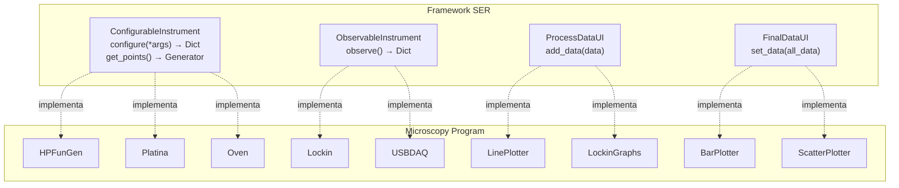
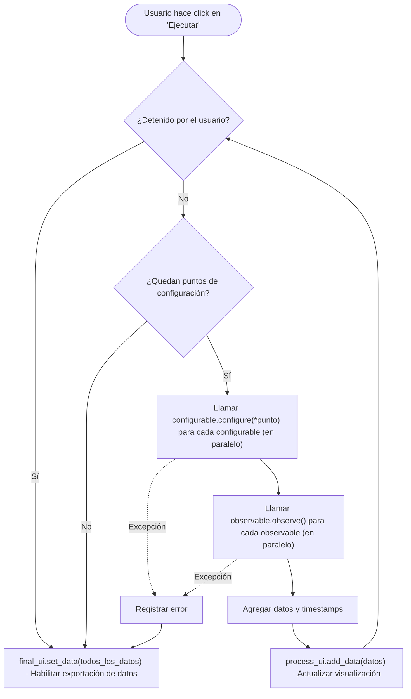

# Manual del Desarrollador - Microscopy-Program

## Tabla de Contenidos

1. [Introduccion](#1-introduccion)
2. [Descripcion General de la Arquitectura](#2-descripcion-general-de-la-arquitectura)
3. [Estructura del Proyecto](#3-estructura-del-proyecto)
4. [Stack Tecnologico](#4-stack-tecnologico)
5. [Frameworks Principales](#5-frameworks-principales)
6. [Sistema de Componentes](#6-sistema-de-componentes)
7. [Referencia de Componentes de Hardware](#7-referencia-de-componentes-de-hardware)
8. [Modelo de Hilos](#8-modelo-de-hilos)
9. [Agregar Nuevos Componentes](#9-agregar-nuevos-componentes)
10. [Sistema de Configuracion](#10-sistema-de-configuracion)
11. [Pruebas y Desarrollo](#11-pruebas-y-desarrollo)
12. [Recursos Externos](#12-recursos-externos)

---

## 1. Introduccion

### Proposito

El **Microscopy-Program** es un software de control de instrumentos de laboratorio basado en Python, disenado para operar un microscopio fototermico. Fue desarrollado en el *Laboratorio de Haces Dirigidos*, Facultad de Ingenieria, Universidad de Buenos Aires, por Facundo Zaldivar Escola.

### Que Hace el Software

La aplicacion coordina multiples instrumentos de laboratorio para realizar experimentos automatizados de microscopia fototermica:

- **Escaneo de Muestras**: Controla platinas de traslacion motorizadas (ejes X, Y, Z)
- **Generacion de Senales**: Controla generadores de funciones para barridos de frecuencia
- **Medicion de Senales**: Lee datos del amplificador lock-in para mediciones de precision
- **Captura de Imagenes**: Captura y muestra imagenes de camara para posicionamiento de muestras
- **Control de Temperatura**: Gestiona experimentos de calentamiento con hornos de temperatura controlada
- **Control de Foco**: Monitorea y ajusta el foco usando retroalimentacion laser y placa DAQ

### Flujo de Trabajo de Alto Nivel

```
1. Seleccion de Dispositivos  -> Seleccionar que instrumentos usar (reales o virtuales)
2. Configuracion              -> Establecer parametros para cada dispositivo
3. Ejecutar Experimento       -> Ejecutar con monitoreo en tiempo real
4. Exportar Datos             -> Guardar resultados en formato CSV o MATLAB
```

---

## 2. Descripcion General de la Arquitectura

### Filosofia de Diseno

El codigo sigue una **Arquitectura Basada en Componentes** utilizando el framework SER (Scientific Experiment Runner). Cada dispositivo de hardware esta encapsulado en una clase `Component` que se integra con el framework para la secuenciacion de experimentos. Para detalles del framework SER y sus interfaces, ver la [Seccion 5](#5-frameworks-principales).

### Diagrama de Arquitectura de Componentes



> [Editar diagrama en mermaid.live](https://mermaid.live/edit#pako:eNptUtFKw0AQ_JXlnhQsYtUXkYKmrQoWii0oJFI2l216trktdxf70PbfvWskibb7tDPDLbNzuxWSMxJ3IHKD6wVM-4kGX7ZMK2KESr8rnfGmEkI9xIkYY640QkYwoRVJqVgH0Fd2zVY59c32PjWXvWGpn0hDUnZvUwk7eGW5VC08YscGPhoiwgINNviZjeZfmIjPlgvodHowGbw1VO3as97j0GBBGzbLgOEsJzcr_Dqzjcp8f_5nWqhH_2aKKUSs5yovDR622kHgBl8kyxbuo2N7NKE2EHGxZk3akfVDX7R1qKVCGzJqaUcDQkVXcZXaKa0bVwme0q7j8Qqd_5ZT4k18SPKfRDpriBr4RlyAKMj4vDJ_HVvhFlQc7iSjOZYrJ_b7H0HsqAc)

---

## 3. Estructura del Proyecto

```
Microscopy-Program/
├── main.py                        # Punto de entrada de la aplicacion
├── debug_main.py                  # Entrada para depuracion/pruebas
├── view_data.py                   # Utilidad para ver datos exportados
├── requirements.txt               # Dependencias de Python
├── frozenreqs.txt                 # Dependencias congeladas con versiones
├── devices.ini                    # Configuracion de dispositivos en tiempo de ejecucion (auto-generado)
│
├── UI/                            # Ventana principal e interfaz a nivel de aplicacion
│   ├── main_window.py             # Clase MainWindow - seleccion e inicializacion de dispositivos
│   └── main_window.ui             # Archivo UI de Qt Designer
│
├── components/                    # Componentes de hardware y modulos de UI
│   ├── __init__.py
│   ├── HP33120AFunGen/            # Componente Generador de Funciones
│   │   ├── __init__.py            # Clase del componente HPFunGen
│   │   ├── hp33120A_fungen.py     # Driver HP 33120A + VirtualFungen
│   │   ├── RigolAdapter.py        # Adaptador para Rigol DG1022
│   │   ├── dll_wrapper.py         # Wrapper USB FTDI para Prologix GPIB
│   │   ├── instrument_ui.py       # FunGenInstrument + FunGenConfUi
│   │   └── conf_ui.ui             # Archivo UI de Qt Designer
│   │
│   ├── Lockin/                    # Componente Amplificador Lock-in
│   │   ├── __init__.py            # Clase del componente AnfatecLockin
│   │   ├── anfatec_driver.py      # Driver Anfatec AMU 2.4 + VirtualLockin
│   │   ├── LI5655.py              # Driver NF LI5655/LI5660
│   │   ├── instrument_ui.py       # LockinInstrument + LockinUI + LockinGraphs
│   │   ├── conf.ui                # UI de configuracion
│   │   ├── graphs.ui              # Dialogo de graficos en tiempo real
│   │   └── demo.txt               # Archivo de datos demo
│   │
│   ├── Platina/                   # Componente Platina de Traslacion (motor)
│   │   ├── __init__.py            # Clase PlatinaComponent
│   │   ├── motor.py               # Driver de motor usando libximc
│   │   ├── instrument_ui.py       # PlatinaInstrument + PlatinaUI
│   │   ├── motor_test.py          # Utilidades de prueba del motor
│   │   ├── conf.ui                # UI de configuracion
│   │   └── *.cfg                  # Archivos de configuracion del motor
│   │
│   ├── CameraPlatina/             # Integracion Camara + Platina
│   │   ├── __init__.py            # Clase CameraPlatinaComponent
│   │   ├── camera.py              # CameraBackend, VirtualCamera, LucamCam
│   │   ├── instrument_ui.py       # CameraPlatinaInstrument + UIs
│   │   ├── calibration.py         # CalibrationUI para calibracion pixel-a-distancia
│   │   ├── custom_image.py        # ImageWidget para imagenes clickeables
│   │   ├── conf.ui                # UI de configuracion
│   │   ├── calibration.ui         # Dialogo de calibracion UI
│   │   └── camera_calibration.npy # Datos de calibracion almacenados
│   │
│   ├── Oven/                      # Componente Control de Temperatura
│   │   ├── __init__.py            # Clase del componente LinkamOven
│   │   ├── TMS94.py               # Driver Linkam TMS94 + VirtualOven
│   │   ├── instrument_ui.py       # OvenInstrument + OvenUI
│   │   └── conf.ui                # UI de configuracion
│   │
│   ├── USBDAQ/                    # Componente placa DAQ (control de foco)
│   │   ├── __init__.py            # Clase del componente USB2527DAC
│   │   ├── USB2527.py             # Driver MCC USB-2527 + VirtualDAC
│   │   ├── instrument_ui.py       # DACInstrument + DACUI + DACGraphs
│   │   ├── conf.ui                # UI de configuracion
│   │   └── graphs.ui              # Dialogo de graficos en tiempo real
│   │
│   ├── LinePlotter/               # Visualizacion de graficos de linea
│   ├── BarPlotter/                # Visualizacion de barras/histogramas
│   └── ScatterPlotter/            # Visualizacion de graficos de dispersion
│
├── Documentation/                 # Capturas de pantalla para documentacion
│
├── preprod/                       # Codigo de pre-produccion/pruebas
│
└── demo/                          # Archivos de configuracion demo
    └── run_conf.json              # Configuracion de experimento de ejemplo
```

---

## 4. Stack Tecnologico

### Tecnologias Principales

| Tecnologia | Version | Proposito |
|------------|---------|-----------|
| **Python** | 3.11.4+ | Lenguaje de programacion principal |
| **PyQt5** | 5.15+ | Framework de interfaz grafica |
| **Lantz** | git | Framework de abstraccion de drivers de hardware |
| **SER** | git | Framework para ejecucion de experimentos cientificos |
| **pyqtgraph** | 0.13.7 | Graficos en tiempo real |
| **OpenCV** | 4.10+ | Procesamiento de camara/imagenes |
| **NumPy** | 1.26+ | Computaciones numericas |
| **Pandas** | 2.2+ | Manipulacion de datos |
| **PyVISA** | 1.14+ | Comunicacion con instrumentos VISA |

### Bibliotecas Externas de Hardware

| Biblioteca | Proposito | Instalacion |
|------------|-----------|-------------|
| **libximc** | Interfaz del controlador de motores Standa | pip (incluido en requirements) |
| **lucam** | SDK de camara Lumenera | pip (incluido en requirements) |
| **mcculw** | DAQ de Measurement Computing | pip (incluido en requirements) |
| **Lockin.dll** | Amplificador lock-in Anfatec | Instalacion manual en `components/Lockin/` |

### Dependencias Principales de requirements.txt

```
opencv-python          # Procesamiento de camara e imagenes
keyboard               # Entrada de teclado para control de motor
libximc                # Controlador de motores Standa
lucam                  # SDK de camara Lumenera
pillow                 # Procesamiento de imagenes
matplotlib             # Graficos auxiliares
mcculw                 # Biblioteca DAQ de MCC
pyqtgraph              # Graficos en tiempo real
SER @ git+https://github.com/FranciscoGauna/SER.git
lantz.drivers @ git+https://github.com/lantzproject/lantz-drivers.git
PyVISA-py              # Comunicacion con instrumentos VISA
```

---

## 5. Frameworks Principales

### Framework SER

El framework SER (Scientific Experiment Runner) proporciona la infraestructura para la secuenciacion de experimentos. Cada dispositivo de hardware esta encapsulado en una clase `Component` que proporciona:

1. **Instrument**: Logica del backend implementando interfaces SER
2. **Driver**: Capa de comunicacion con el hardware (basada en Lantz)
3. **UI de Configuracion**: Widgets PyQt5 para configuracion de parametros
4. **UI de Ejecucion** (opcional): Visualizacion en tiempo real durante experimentos

El framework gestiona:

- Generacion y disposicion de UI de configuracion
- Bucle de ejecucion de experimentos
- Recoleccion y agregacion de datos
- Visualizacion y exportacion de resultados

**Interfaces Principales de SER:**

```python
from SER.interfaces import (
    Component,                 # Clase base para componentes de hardware
    ComponentInitialization,   # Envoltorio con informacion de posicion/nombre
    ConfigurableInstrument,    # Dispositivos que se configuran antes de la medicion
    ObservableInstrument,      # Dispositivos que observan/miden datos
    ConfigurationUI,           # Widgets de UI para configuracion
    ProcessDataUI,             # Visualizacion de datos en tiempo real
    FinalDataUI,               # Visualizacion de datos finales
)
from SER import get_main_widget  # Crea la UI principal del experimento
```

**Detalles de las Interfaces:**

1. **ConfigurableInstrument**: Para dispositivos que necesitan configuracion antes de cada punto de medicion
   ```python
   class MiInstrumento(ConfigurableInstrument):
       def configure(self, *args) -> Dict[str, Any]:
           """Ejecutar configuracion y devolver resultados"""
           pass

       def get_points(self) -> Generator:
           """Generar puntos de configuracion"""
           pass

       def point_amount(self) -> int:
           """Devolver cantidad total de puntos"""
           pass
   ```

2. **ObservableInstrument**: Para dispositivos que miden/observan datos
   ```python
   class MiObservador(ObservableInstrument):
       def observe(self) -> Dict[str, Any]:
           """Tomar una medicion y devolver resultados"""
           pass
   ```

3. **ConfigurationUI**: Para widgets de configuracion de dispositivos
   ```python
   class MiConfigUI(ConfigurationUI):
       gui = "ruta/al/archivo_ui.ui"

       def __init__(self, backend):
           super().__init__(backend=backend)
   ```

### Flujo de Ejecucion del Experimento



> [Editar diagrama en mermaid.live](https://mermaid.live/edit#pako:eNx1U9uO0zAQ_ZWRXzZFtB-wD6Bqt4iVEAhKnwiqpvY09a5jW75UC20_iSc-AIn9MWwnvUTLRoo0ts9l5sTZMW4EsWvWOLQb-Hpba0jPPKAL1beaLXxEJw1skBNwJfkDkIar2T3xmDBXNfs-uqDAePwGbjbEH-bB2F3N_v65pUBaCgPWOCAFsVN8W7NDRzzBM3lfs_nTr5rt4Z3UqORP-j_oo8mYqdii5lR8PkcSqMFGHYwHkbo1ei2b6JDLp9_67NeTBkJDsyGi7-eml6OUygeFLbqzw0rR5Lig6lXpYQQWHQJHgQMgVCnAfKRImVHKrx_wSC8Rflp5ctsLK1M2ilFXUnVpcD5-Qb4XLOIpxjLFtHHUJG2BObEfEGRLPmBr_YlWoIW0uFvYBMw86wwn75dRTlCIZdrFqmiMYAxTHmKOMulupe_K8gFOmkel4V15lsKkhD975GR7_h5mzhmXOvhCjfTBJQ_KO8-nfJHc4UpZ_Icf_rhKFutc5hE9hW7EYITxS5Xe07DvcSWVDLmPx3S9QzdpvnwFkvpir1lLrkUp2PWOhQ21-WcTtMaoAjsc_gHEuTb_)

### Formato de Salida de Datos

Los datos del experimento se recolectan como diccionarios y se exportan como CSV:

```csv
time,Platina_motor_x_position,Platina_motor_y_position,Fungen 1_frequency,Lockin_amplitude,Lockin_phase,...
0.0,0.0,0.0,100.0,0.00123,45.2,...
0.5,1.0,0.0,200.0,0.00098,42.1,...
```

Los nombres de columna se generan a partir de: `{nombre_componente}_{nombre_variable}`

### Framework Lantz

Lantz proporciona abstraccion de drivers de hardware con integracion Qt. Caracteristicas principales:

- **Feats**: Accesores tipo propiedad para parametros del hardware
- **Envoltorio Qt**: Integracion con GUI segura para hilos
- **Unidades**: Manejo de unidades fisicas

Para ejemplos y documentacion, ver el [repositorio de Lantz](https://lantz.readthedocs.io/).

---

## 6. Sistema de Componentes

### Estructura de un Componente

Todo componente de hardware sigue este patron:

```python
class MiComponente(Component):
    """Componente que envuelve un dispositivo de hardware"""

    @classmethod
    def virtual(cls):
        """Metodo de fabrica para modo virtual/pruebas"""

    @classmethod
    def real(cls, *args_conexion):
        """Metodo de fabrica para hardware real"""

    def close_component(self):
        """Limpieza cuando el componente se cierra"""
```

### ComponentInitialization

La clase `ComponentInitialization` envuelve componentes con metadatos para el framework SER:

```python
fungen_init = ComponentInitialization(
    component=fungen_comp,    # La instancia del Component
    position_priority=0,      # Prioridad de orden de ejecucion
    row=0,                    # Fila en la grilla de la UI de configuracion
    column=1,                 # Columna en la grilla de la UI de configuracion
    name="Fungen 1"           # Nombre para mostrar (tambien usado como prefijo de clave de datos)
)
```

### Registro de Componentes

Los componentes se registran en `UI/main_window.py`:

```python
class MainWindow(QMainWindow):
    def load_options(self):
        # Definir metodos de fabrica para cada opcion de dispositivo

    def switch_window(self):
        # Crear componentes basados en la seleccion del usuario
        # y pasarlos al framework SER via get_main_widget
```

---

## 7. Referencia de Componentes de Hardware

### 7.1 HP33120AFunGen (Generador de Funciones)

**Dispositivos Soportados:**
- HP 33120A (mediante adaptador Prologix GPIB)
- Rigol DG1022 (mediante USB)
- Virtual (para pruebas)

**Parametros Configurables:**
- Tipo de forma de onda (SIN, SQU, TRI, RAMP, NOIS, DC, USER)
- Rango de frecuencia (barrido lineal o logaritmico)
- Amplitud y offset DC

### 7.2 Lockin (Amplificador Lock-in)

**Dispositivos Soportados:**
- Anfatec AMU 2.4 (mediante DLL)
- NF LI5655/LI5660 (mediante VISA/USB)
- Virtual/Demo (para pruebas)

**Salidas Observables:**
- Amplitud (V)
- Fase (grados)
- Graficos de monitoreo en tiempo real

### 7.3 Platina (Platina de Traslacion)

**Dispositivos Soportados:**
- Cualquier motor compatible con XIMC de Standa
- Virtual (motor emulado)

**Caracteristicas:**
- Movimiento sincrono y asincrono
- Retroalimentacion de posicion con soporte de encoder
- Compensacion de backlash
- Control de velocidad/aceleracion
- Movimiento jog controlado por teclado

### 7.4 CameraPlatina (Integracion Camara + Platina)

**Camaras Soportadas:**
- Lumenera Infinity 1 (mediante SDK lucam)
- Cualquier webcam compatible con OpenCV
- Virtual (para pruebas)

**Caracteristicas:**
- Vista previa de camara en vivo
- Click para definir trayectoria de escaneo
- Calibracion pixel-a-motor
- Modos de escaneo cuadrado (grilla) o lineal

### 7.5 Oven (Control de Temperatura)

**Dispositivos Soportados:**
- Linkam TMS 94 (mediante serial)
- Virtual (para pruebas)

**Parametros Configurables:**
- Rango de temperatura
- Velocidad de calentamiento

### 7.6 USBDAQ (Placa DAQ / Control de Foco)

**Dispositivos Soportados:**
- MCC USB-2527 (mediante mcculw)
- Virtual (para pruebas)

**Caracteristicas:**
- Entrada/salida analogica
- E/S digital para control de laser
- Monitoreo de foco en tiempo real
- Senales de suma y error de foco del fotodiodo ABCD

### 7.7 Componentes de Visualizacion

**LinePlotter** (`components/LinePlotter/`):
- Graficos de linea/dispersion en tiempo real
- Implementa la interfaz `ProcessDataUI`

**BarPlotter** (`components/BarPlotter/`):
- Graficos de barras e histogramas
- Implementa las interfaces `ProcessDataUI` y `FinalDataUI`

---

## 8. Modelo de Hilos

La aplicacion utiliza multiples hilos para mantener la interfaz responsiva mientras se comunica con el hardware. El hilo principal ejecuta el bucle de eventos de PyQt5 y gestiona toda la interfaz grafica. Los hilos secundarios, creados como hilos daemon mediante el modulo `threading` de Python, se encargan de tareas de larga duracion como la consulta continua del estado de los motores, la captura de cuadros de la camara, la lectura de entradas analogicas de la placa DAQ y el monitoreo del amplificador lock-in. Para mas informacion sobre el modulo `threading`, ver [la documentacion oficial de Python](https://docs.python.org/3/library/threading.html).

Para actualizar la interfaz de forma segura desde estos hilos en segundo plano, la aplicacion utiliza el mecanismo de senales y slots de Qt. Cada hilo secundario emite senales de Qt con los datos leidos del hardware, y los slots correspondientes en el hilo principal reciben esas senales y actualizan los widgets de la UI. Esto garantiza que todas las operaciones sobre la interfaz grafica ocurran en el hilo principal, evitando condiciones de carrera y errores de acceso concurrente. Para mas detalles sobre senales y slots, ver [la documentacion de Qt](https://doc.qt.io/qt-5/signalsandslots.html).

---

## 9. Agregar Nuevos Componentes

Para agregar un nuevo componente de hardware al sistema, seguir estos pasos:

1. **Crear directorio del componente:** Crear `components/NuevoDispositivo/` con los archivos `__init__.py`, `driver.py` e `instrument_ui.py`.
2. **Crear el driver en `driver.py`:** Heredar de `Driver` (Lantz), implementar `initialize()`, `finalize()` y los `Feat`/`Action` necesarios. Crear tambien un driver virtual para pruebas.
3. **Crear el instrumento en `instrument_ui.py`:** Heredar de `ConfigurableInstrument` u `ObservableInstrument` (SER), implementar `configure()`/`observe()`, `get_points()`, `point_amount()`, `get_config()` y `set_config()`.
4. **Crear la UI de configuracion en `instrument_ui.py`:** Heredar de `ConfigurationUI` (SER), apuntar `gui` al archivo `.ui` y conectar los widgets al instrumento.
5. **Crear el archivo UI:** Disenar `conf.ui` en Qt Designer con los widgets de configuracion del dispositivo.
6. **Crear la clase del componente en `__init__.py`:** Heredar de `Component` (SER), implementar classmethods `virtual()` y `real()` que instancien driver, instrumento y UI.
7. **Registrar en MainWindow:** En `UI/main_window.py`, agregar las opciones del dispositivo en `load_options()` y crear el `ComponentInitialization` correspondiente en `switch_window()`.
8. **Actualizar main_window.ui:** Agregar un ComboBox y Label para el nuevo dispositivo en Qt Designer.

---

## 10. Sistema de Configuracion

### Configuracion en Tiempo de Ejecucion (devices.ini)

El archivo `devices.ini` almacena parametros de conexion para dispositivos de hardware. Se auto-genera en la primera ejecucion con valores por defecto.

**Ubicacion:** Mismo directorio que `main.py`

**Formato:**
```ini
[HP33120AFungen]
PROLOGIX ADDR = 10

[Web Cam]
Index = 0

[Linkam TMS 94]
Port = 15

[USB2527DAC]
Board Num = 0
```

**Como funciona en el codigo:**

```python
# UI/main_window.py
from configparser import ConfigParser

config = ConfigParser()

# Valores por defecto
config["HP33120AFungen"] = {"PROLOGIX ADDR": "10"}
config["Web Cam"] = {"Index": "0"}
# ...

# Cargar o crear archivo
if path.exists("devices.ini"):
    config.read("devices.ini")
else:
    with open("devices.ini", "w") as f:
        config.write(f)

# Usar en metodos de fabrica
lambda: HPFunGen.via_prologix_gpib(int(config["HP33120AFungen"]["PROLOGIX ADDR"]))
```

### Agregar Nuevas Opciones de Configuracion

1. Agregar valor por defecto en `MainWindow`:
   ```python
   config["NuevoDispositivo"] = {"Port": "COM3", "Baudrate": "9600"}
   ```

2. Usar en metodo de fabrica:
   ```python
   self.nuevo_disp_ops = {
       "Real": lambda: NuevoDispositivoComponent.real(
           config["NuevoDispositivo"]["Port"],
           int(config["NuevoDispositivo"]["Baudrate"])
       ),
   }
   ```

### Configuracion de Experimento (JSON)

Los parametros de experimento se pueden guardar/cargar como JSON:

```python
# Guardar configuracion
config_dict = {}
for component in components:
    config_dict[component.name] = component.instrument.get_config()

with open("config_experimento.json", "w") as f:
    json.dump(config_dict, f, indent=2)

# Cargar configuracion
with open("config_experimento.json", "r") as f:
    config_dict = json.load(f)

for component in components:
    if component.name in config_dict:
        component.instrument.set_config(config_dict[component.name])
```

### Archivos de Configuracion de Motor (.cfg)

Los archivos de configuracion de motor estan en formato XIMC y se ubican en `components/Platina/`:

| Archivo | Motor |
|---------|-------|
| `8MT173-10.cfg` | Standa 8MT173-10 |
| `8MT173-10-Encoder.cfg` | Mismo con encoder |
| `8MTF-75LS05-Encoder-x.cfg` | Eje X con encoder |
| `8MTF-75LS05-Encoder-y.cfg` | Eje Y con encoder |
| `flash_eje_x.cfg` | Platina flash eje X |
| `flash_eje_y.cfg` | Platina flash eje Y |

---

## 11. Pruebas y Desarrollo

### Ejecucion en Modo Virtual

Todos los componentes soportan modo "Virtual" para pruebas sin hardware:

```bash
python main.py
# Seleccionar "Virtual" para todos los desplegables de dispositivos
# Hacer click en "Lanzar"
```

### Configuracion Demo

Cargar configuracion demo desde `demo/run_conf.json`:

```python
# En el widget SER, usar la funcion de cargar configuracion
# para importar demo/run_conf.json
```

### Pruebas de Componentes

Las pruebas individuales de componentes se pueden ejecutar desde `preprod/` o los directorios de componentes:

```bash
# Probar motor
python -m components.Platina.motor_test

# Probar lock-in
python preprod/lockin.py

# Probar camara
python preprod/camera.py
```

### Punto de Entrada de Depuracion

Usar `debug_main.py` para pruebas de desarrollo:

```bash
python debug_main.py
```

### Crear Datos de Prueba

Para `DemoLockin`, los datos se cargan desde `components/Lockin/demo.txt`:

```
# formato de demo.txt (separado por tabulaciones)
amplitud   fase
0.001      45.2
0.002      42.1
...
```

### Logging

La aplicacion usa el sistema de logging de Lantz:

```python
from lantz.core.log import log_to_screen
from logging import DEBUG, INFO, WARNING, ERROR

# En main.py
log_to_screen(ERROR)  # Solo mostrar errores

# Para desarrollo, usar DEBUG
log_to_screen(DEBUG)
```

---

## 12. Recursos Externos

### Documentacion

| Recurso | URL |
|---------|-----|
| Framework SER | https://github.com/FranciscoGauna/SER |
| Documentacion de Lantz | https://lantz.readthedocs.io/ |
| Documentacion de Motores XIMC | https://files.xisupport.com/Software.en.html |
| Documentacion de PyQt5 | https://www.riverbankcomputing.com/static/Docs/PyQt5/ |
| Documentacion de pyqtgraph | https://pyqtgraph.readthedocs.io/ |

### Enlaces de Fabricantes de Hardware

| Dispositivo | Fabricante | Enlace |
|-------------|------------|--------|
| Lock-in AMU 2.4 | Anfatec | https://www.anfatec.de/ |
| Platinas de Traslacion | Standa | https://www.standa.lt/ |
| Camaras | Lumenera | https://www.lumenera.com/ |
| Placas DAQ | Digilent/MCC | https://www.mccdaq.com/ |
| Platinas Linkam | Linkam | https://www.linkam.co.uk/ |

### Herramientas de Desarrollo

| Herramienta | Proposito |
|-------------|-----------|
| Qt Designer | Diseno de layout de UI |
| NI MAX | Descubrimiento de dispositivos VISA |
| Anaconda | Gestion de entornos Python |

---
