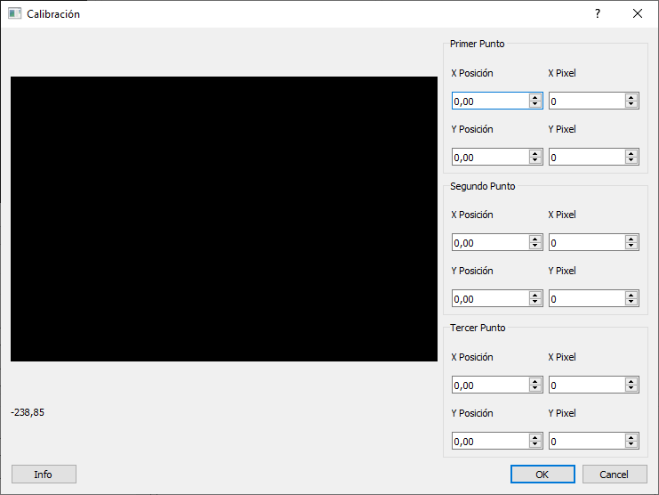
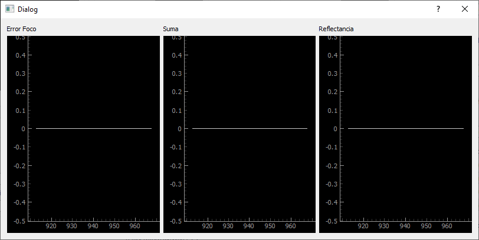
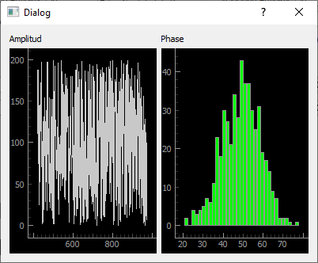

# Microscopy-Program
## Resumen
Este programa es un software cuyo objetivo es controlar el 
microscopio fototérmico desarrollado por Facundo Zaldivar Escola.

## Instalación
### Python

La version de python utilizada para el desarrollo fue Python 3.11.4.
Se puede descargar del siguiente link https://www.anaconda.com/download.

### Biblioteca

Para instalar las bibliotecas de python es solo necesario hacer el comando
`pip install -r requirements.txt`. Proveo también el archivo `frozenreqs.txt`
que contienen la version específica de las bibliotecas de python
con las cuales se testeó y utilizo el programa.

### Dispositivos Externos

El funcionamiento del Microscopy-Program depende de drivers de dispositivos externos. 
Listo los drivers utilizados.

Lock-in AMU 2.4: [`AMU 2.4 Lockin.dll` de Anfatec](https://www.anfatec.de/products/3_lockin/amu/24/pci-bus_lockin_amplifier_amu24.html)

Platina:[`XIMC Software Package` de Standa](https://files.xisupport.com/Software.en.html)

Camara: [`LgCam Software` de Lumenera](https://www.lumenera.com/support/industrial-usb-ethernet/drivers-downloads.html)

DAQ: [`MCCDAQ` de Diligent](https://cloud.digilent.com/myproducts/ULxforWindows?pc=1&tab=2)

## Utilización

Nota: ver tambien documentacion del [SER](https://github.com/FranciscoGauna/SER)
para mas detalles sobre la utilizacion de este software. Esta documentacion
se enfoca en los detalles pertinentes a los dispositivos asociados al 
setup experimental asociado con el microscopio fototermico del 
laboratorio de haces dirigidos en la Faculta de Ingenieria de la
Universidad de Buenos Aires.

### Seleccionar Dispositivos

Esta pantalla permite seleccionar que instancia de dispositivos se quieren 
utilizar. 

"Virtual" indica que este dispositivo no va a conectarse a un
dispositivo real, sino que va a utilizar un driver que pretende estar conectado.

Los siguientes dispositivos están disponibles para los siguientes tipos de 
dispositivos:

Generador de Funciones:
- HP 33120A
- Rigol DG1022

Amplificador Lock-in:
- Anfatec AMU 2.4
- NF LI5660

Platina:  
La platina soporta cualquier motor conectado que responda al xilab.

Camara:
- Lumenera Infinity 1
- Web Cam controlada por CV2

Horno:
- Linkam TM 94

Digital-to-Analog-Converter (DAC):
- MCC USB-2527

Los motores de la platina pueden ser cargados con archivos de configuracion
provistos por xilab para ese motor especifico. Estos incluyen informacion
sobre el feedback, si la direccion positiva esta invertida y sobre la
relacion entre cuentas del motor y la distancia real. Si se tiene esta ultima
la pantalla siguiente muestra la posicion en la unidad indicada.

Una vez seleccionado los dispositivos lanzar inizaliza los dispositivos.

#### Configuración de Conexión

Cada dispositivo provisto tiene diferentes métodos de conexión.
En el caso de la camara web, el generador de funciones HP 33120A, 
el horno Linkam y la placa DAC USB tienen parámetros de conexión dependientes
de como esten conectados. Estos se pueden configurar en el archivo `devices.ini`
que es generado con valores por defecto cuando se corre el programa 
por primera vez.

### Configurar Corrida

Esta pantalla permite configurar los parámetros con los cuales se va a 
ejecutar el experimento. Cada dispositivo tiene su propio grupo de controles
indicando que opciones se pueden modificar.

Cámara: La cámara tiene un cuadrado mostrando continuamente fotos del
dispositivo. Se puede además clickear en la pantalla para asignar 
la ruta de movimiento de la platina. Este movimiento se puede calibrar
con el botón calibrar. La selección de cuadrado/línea indica si el motor
X y el motor Y se mueven en paralelo o simultáneo respectivamente.

Pantalla de calibración:

Motor: Cada motor tiene una posición actual y sus parámetros de
velocidad, aceleración y antiplay (backlash). Se puede cambiar el cero
con el botón que indica que la posición actual es el cero. Durante
la corrida, el motor va a ir de la posición inicial a la final con
la cantidad de pasos indicando cuantas paradas hace. Ejemplo: si el motor
x/y están en modo línea con los parámetros: inicial 0, final 2, pasos 3; 
las posiciones van a ser (0,0), (1,1), (2,2).

Mover Motor: esta sección permite enviar el motor a la posición en
la caja de arriba. La caja de abajo guarda la posición en la cual 
estaba cuando se movió. Stop para el motor en el momento, en caso de
que haya un error. 

Generador de Funciones: permite configurar la amplitud, el offset, 
la forma y el rango de frecuencias. Todos los valores de frecuencias
son en Hertz.
El rango de frecuencias puede ser lineal o logarítmico. Ejemplo:
Con los parámetros frecuencia inicial 10, frecuencia inicial 1000,
pasos 3; las frecuencias van a ser 10, 100, 1000.

Horno: permite configurar el rango de temperatura del horno.

Control de Foco: permite prender y apagar el control laser
de prueba, controlar su potencia y ver los gráficos de reflectancia, 
suma abcd y error de foco. El control de foco automáticamente enfoca
el motor moviendo el eje Z con los parámetros provistos (no funcional).

Lockin: permite configurar la constante de tiempo, la ganancia, la curva,
el armónico y la referencia externa. Importante: para los experimentos, la
referencia externa tendría que estar siempre prendida.

Acoplamiento: permite indicar qué dispositivos están acoplados y el orden 
de los puntos. Los dispositivos con el valor más alto varían sus puntos 
primero. Ejemplo: si la el horno está acoplado en 1 con los valores
40° y 50° y el generador de frecuencia está acoplado en 2 con los valores
100Hz y 1000Hz los puntos son (40°, 100Hz) -> (40°, 1000Hz)
 -> (50°, 100Hz) -> (50°, 1000Hz).

### Ver Corrida

Esta pantalla permite monitorear el progreso de la corrida del experimento.
Los graficos muestran los valores de fase (°/log(Hz)) y 
amplitud (log(V)/log(Hz)). El boton de "Parar" aborta la ejecuccion del
programa.

### Tabla de Datos

Esta pantalla permite ver los datos finales del experimento. Arriba a la 
izquierda se puede guardar la informacion de las variables, indicando
que significa cada valor y su unidad. Arriba a la derecha se puede
guardar la tabla de datos, tanto en formato matlab como formato
csv (comma separated values).

